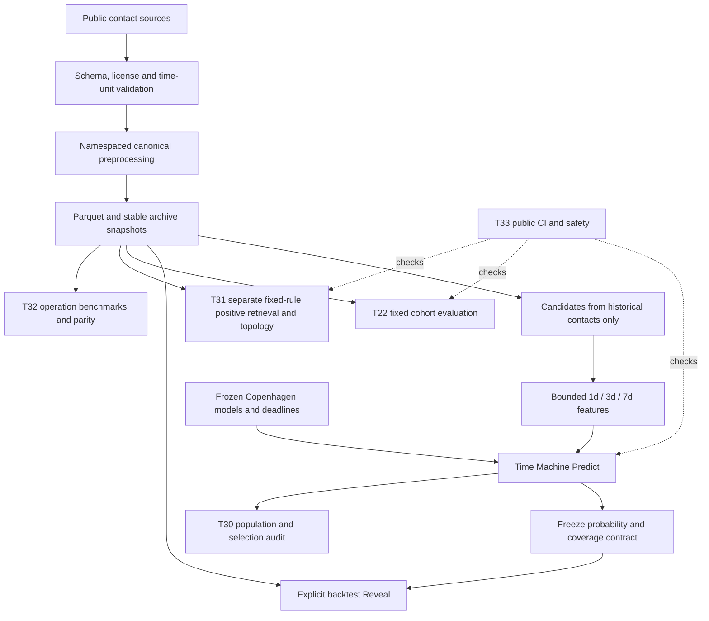

# Portfolio guide

Encounter Lab investigates whether anonymous device pairs will have a recorded contact within 24 hours. The work combines real Copenhagen modeling, information-budget comparisons, historical inference, observation-bias analysis and public code verification. It predicts device proximity evidence, not social intent or relationships.

The implementation covers data adapters, bounded historical feature engineering, chronological purging, frequency/logistic/XGBoost baselines, calibration where validation support permits, model persistence, network exploration, Streamlit interaction, parity-preserving caching and CI/security. Technical decisions and evidence can be inspected in the [final task index](FINAL_RESEARCH_AUDIT.md).

Offline model fitting is performed on purged historical training data, with validation-only selection. It is distinct from inference and is not rerun by the final audit. T31 ranking rules do not train Copenhagen models.

The central research decision was to hold T22 candidate keys, labels, splits and protocol fixed while bounding every feature to its declared 1/3/7-day history. Seven-day XGBoost AP was 0.691366 on 25,569 samples across four dates, compared with 0.588723 at one day. Four dates cannot establish significance or long-term generalization. T17's different cohort and feature budget prevent direct score comparisons.

Removing future-dependent candidate filtering creates a selection problem, not a free performance gain. T30 preserves all 38,005 historical candidates, keeps 10,185 Unknown visible, and reports metrics on the 27,802 both-predictable-and-reliable cases. Its AP 0.758930 and Brier 0.128114 concern a changed population; added known cases are all positive. The audit exposes this bias rather than labeling Unknown as negative.

Multiple sources cannot be pooled casually: anonymous identities, units, sampling and observation evidence differ. Workplace supports only positive retrieval, High School has short history, MIT Reality Mining lacks tick mapping, Social Evolution lacks a verified usable source. Source-specific analysis is scientifically useful without fictitious classification scores.

Leakage controls exclude events at/after t from inference, verify model information deadlines, freeze verified coverage policies and separate Reveal. Cache keys bind source/version/time/window/policy; snapshot/version checks and parity tests protect outputs. T32 improved measured warm operations while adding cold validation costs. Stable archive snapshots retain TOCTOU and ingestion limitations.

Public Linux CI demonstrates code, synthetic boundary behavior, native libraries, page navigation and safety checks without publishing data or weights. It does not prove raw-data replication or real-world predictive utility. Remaining work could include lawful independent observation logs, more untouched test dates/populations, trusted ingestion provenance and broader performance environments. None is implemented by this delivery.
